<p align="center">
  <a href="https://keyfixer.vercel.app">
    
  </a>
</p>

<p align="center">
  <strong>KeyFixer</strong> — Privacy-First Arabic ⇄ English Keyboard Layout Switcher &amp; Native Desktop Utility
</p>

<p align="center">
  <a href="https://apps.microsoft.com/detail/9pk3g83gp41d?ocid=webpdpshare"></a>
  <a href="https://chromewebstore.google.com/detail/bgleifjaplnanbncododdkgkpaieeafg?utm_source=item-share-cb"></a>
  <a href="https://keyfixer.vercel.app"></a>
  <a href="https://github.com/obadadallo95/keyfixer/releases"></a>
</p>

<p align="center">
  
  
  
  
  
  
</p>

<p align="center">
  <a href="#english">English</a> • <a href="#arabic">العربية</a> • <a href="#features">Features</a> • <a href="#platforms">Platforms</a> • <a href="#architecture">Architecture</a> • <a href="#development">Development</a> • <a href="#documentation">Documentation</a>
</p>

---

<a name="english"></a>
## 🌟 About KeyFixer

**KeyFixer** is a high-performance, privacy-first utility that instantly corrects text accidentally typed with the wrong keyboard layout (Arabic ↔ English). 

Ever typed a full sentence looking at the screen only to realize you typed `lh h[lg hg;jhf]` instead of `ما اجمل الكتابة`? KeyFixer fixes it in **0ms** using physical keycap position translation—completely offline with **zero data collection, zero network calls, and zero tracking**.

Available as a **Windows Desktop App on Microsoft Store**, **Google Chrome Extension on Chrome Web Store**, **macOS Desktop App**, and **Progressive Web App**.

---

<a name="platforms"></a>
## 📦 Official Releases & Download Links

| Platform | Distribution Channel | Status | Link |
| :--- | :--- | :---: | :--- |
| **Windows 10 / 11** | **Microsoft Store (MSIX)** |  | [**Get it from Microsoft Store**](https://apps.microsoft.com/detail/9pk3g83gp41d?ocid=webpdpshare) |
| **Google Chrome / Edge** | **Chrome Web Store** |  | [**Add to Chrome**](https://chromewebstore.google.com/detail/bgleifjaplnanbncododdkgkpaieeafg?utm_source=item-share-cb) |
| **macOS (Apple Silicon / Intel)** | **Mac App Store / Direct DMG** |  | [**GitHub Releases**](https://github.com/obadadallo95/keyfixer/releases) |
| **Web Browser** | **PWA & Live Web App** |  | [**Launch Web App**](https://keyfixer.vercel.app) |

---

<a name="features"></a>
## ⚡ Core Features

- 🔄 **Bidirectional Instant Conversion**: Translates Arabic ↔ English based on physical keyboard layout mapping.
- 🧠 **Smart Auto-Detection**: Automatically detects input character distribution and picks the correct conversion direction.
- ⚡ **0ms Local Engine**: Synchronous local processing in device memory. No network latency.
- 🛡️ **100% Offline & Private**: Zero servers, zero telemetry, zero analytics, zero external network requests.
- ⌨️ **Global System Shortcuts**:
  - macOS: `⌥⌘K` (Option + Command + K)
  - Windows: `Ctrl + Alt + K`
- 🪟 **Collapsible Document Picture-in-Picture (PiP)**: Floats above all desktop apps on Chromium browsers.
- 🔤 **Complete Layout Mappings**:
  - Windows Arabic 101 Layout
  - Apple macOS Arabic Layout
  - Full support for Arabic ligatures (`لا`, `لأ`, `لإ`, `لآ`), diacritics (Tashkeel), numbers, and symbols.
- 🔊 **Haptic & Audio Feedback**: Optional synthesized mechanical keyboard click sounds.
- 🎨 **Modern Dark Aesthetics**: Glassmorphism UI with warm amber ambient glows, full RTL/LTR responsiveness, and system theme auto-detection.

---

## 🎯 Conversion Examples

```text
English Keyboard (Arabic intent)  →  ما اجمل الكتابة  (lh h[lg hg;jhf])
Arabic Keyboard (English intent)  →  hello world      (اثممخ صخقmovement)
Ligatures & Shift Mappings        →  الإسلام والسلام   (hghsghl ,hgsghl)
```

---

<a name="architecture"></a>
## 🏗️ System Architecture

KeyFixer is structured as a modular TypeScript/Rust monorepo that decouples core conversion logic from platform-specific frontends:

```
                               ┌─────────────────────────────┐
                               │     Shared Core Engine      │
                               │     src/core/keyboard/      │
                               │  - Windows Arabic 101 Map   │
                               │  - macOS Arabic Layout Map  │
                               │  - Auto-Detection Algorithm │
                               └──────────────┬──────────────┘
                                              │
               ┌──────────────────────────────┼──────────────────────────────┐
               │                              │                              │
 ┌─────────────▼────────────┐   ┌─────────────▼────────────┐   ┌─────────────▼────────────┐
 │    React 19 Web / PWA    │   │ Chrome Extension (MV3)   │   │  Tauri v2 Desktop App    │
 │   - Tailwind CSS v4      │   │   - Context Menus API    │   │   - Rust Backend Engine  │
 │   - Audio Click Engine   │   │   - In-page Scripting    │   │   - System Tray & Hotkeys│
 │   - Document PiP HUD     │   │   - Zero Host Permission │   │   - Windows MSIX Package │
 └──────────────────────────┘   └──────────────────────────┘   │   - Mac StoreKit Sandbox │
                                                               └──────────────────────────┘
```

---

<a name="development"></a>
## 🛠️ Development & Build Setup

### Prerequisites
- **Node.js**: v22.x or higher
- **npm**: v10.x or higher
- **Rust Toolchain**: `stable` (for desktop Tauri builds)

### Quick Start

```bash
# 1. Clone repository
git clone https://github.com/obadadallo95/keyfixer.git
cd keyfixer

# 2. Install dependencies
npm install

# 3. Launch Development Environments
npm run dev              # Launch Web App (http://localhost:5173)
npm run dev:desktop      # Launch Desktop React Frontend
npm run tauri dev        # Launch Native Tauri Desktop Window
```

### Production Build Commands

```bash
# Web Application
npm run build:web

# Chrome Extension (outputs to extension/dist/)
npm run build:extension

# Windows Desktop (MSIX Package for Microsoft Store)
npm run build:windows:msix

# macOS Desktop (Mac App Store Sandboxed Bundle)
npm run build:appstore

# Version Synchronization Check
npm run version:check
```

### Automated Testing Suite (106 Tests)

```bash
npm run test:run        # Run full Vitest suite (106 unit & integration tests)
npm run typecheck       # TypeScript verification
npm run release:check   # Full pre-release validation pipeline
```

---

<a name="documentation"></a>
## 📚 Documentation Index

| Guide | Description |
| :--- | :--- |
| [**Architecture Overview**](docs/architecture.md) | Deep dive into the offline conversion engine & data flow |
| [**Microsoft Store MSIX**](docs/microsoft-store-msix.md) | Windows packaging, MakeAppx workflow & Store ID (`9PK3G83GP41D`) |
| [**Windows Desktop App**](docs/windows.md) | Windows shortcuts, tray behavior, and NSIS/MSIX instructions |
| [**Chrome Extension**](docs/chrome-extension.md) | Manifest V3 permissions, background service worker & content script |
| [**Chrome Web Store Guide**](docs/publishing-chrome-web-store.md) | Packaging and store publication checklist |
| [**macOS Desktop App**](docs/desktop-app.md) | Menu bar accessory mode, global shortcuts (`⌥⌘K`), and sandboxing |
| [**Mac App Store Release**](docs/mac-app-store.md) | Code signing, provisioning profiles & Apple review requirements |
| [**Floating PiP Window**](docs/floating-window.md) | Collapsible Document Picture-in-Picture implementation details |
| [**Keyboard Layouts**](docs/keyboard-layouts.md) | Specification of Windows 101 and Apple Arabic mapping tables |
| [**Development Guide**](docs/development.md) | Local environment setup, scripts, and monorepo structure |
| [**Testing & QA**](docs/testing.md) | Vitest testing scope, edge cases, and automated validation |
| [**Changelog**](docs/changelog.md) | Complete version history from v1.0.0 through v1.3.1 |
| [**Privacy Policy**](docs/privacy.md) | Formal zero-data collection guarantee |
| [**Terms of Use**](docs/terms.md) | Acceptable use terms and disclaimer |

---

<a name="arabic"></a>
## <div dir="rtl">🇸🇦 العربية</div>

<div dir="rtl">

### نبذة عن KeyFixer

**KeyFixer** هي أداة سريعة وخاصة مصممة لتصحيح النصوص المكتوبة بتخطيط لوحة مفاتيح خاطئ (عربي ⇄ إنجليزي) فوراً ودون أي تأخير.

كم مرة كتبت فقرة كاملة دون النظر للشاشة لتكتشف أنك كتبت `lh h[lg hg;jhf]` بدلاً من `ما اجمل الكتابة`؟ يقوم KeyFixer بمعالجة النص وتصحيحه في **0 ميلي ثانية** اعتماداً على مواقع المفاتيح الفيزيائية، محلياً بالكامل على جهازك دون إرسال أي حرف إلى أي خادم، وبدون إعلانات أو تتبع.

---

### روابط التحميل الرسمية

- 🪟 [**الحصول على KeyFixer من متجر مايكروسوفت (Microsoft Store)**](https://apps.microsoft.com/detail/9pk3g83gp41d?ocid=webpdpshare)
- 🌐 [**تثبيت إضافة كروم من سوق Chrome الإلكتروني**](https://chromewebstore.google.com/detail/bgleifjaplnanbncododdkgkpaieeafg?utm_source=item-share-cb)
- 🍎 [**تحميل تطبيق macOS من إصدارات GitHub**](https://github.com/obadadallo95/keyfixer/releases)
- 💻 [**استخدام نسخة الويب المباشرة (PWA)**](https://keyfixer.vercel.app)

---

### أبرز المزايا

1. **تحويل فوري ثنائي الاتجاه**: تحويل دقيق بين الحروف العربية والإنجليزية.
2. **كشف تلقائي ذكي**: تحديد لغة النص المقصودة تلقائياً.
3. **أوفلاين وخاص 100%**: المعالجة تتم في ذاكرة جهازك فقط دون أي اتصال بالإنترنت.
4. **اختصارات نظام عالمية**:
   - أجهزة ماك: `⌥⌘K`
   - أجهزة ويندوز: `Ctrl + Alt + K`
5. **نافذة عائمة قابلة للطي (Picture-in-Picture)**: تطفو فوق كافة البرامج على سطح المكتب.
6. **دعم كامل للتراكيب والتشكيل**: معالجة الحروف المركبة مثل (`لا`، `لأ`، `لإ`، `لآ`) والحركات والأرقام.
7. **تأثيرات صوتية اختيارية**: محاكاة صوت نقرات الكيبورد الميكانيكي.

</div>

---

## 🔒 Privacy Guarantee

KeyFixer adheres to an uncompromising zero-telemetry policy:
- **No network transmission**: Text input is converted in synchronous local memory and immediately discarded.
- **No cloud dependencies**: Does not contact remote APIs or external servers.
- **No analytics or ads**: Zero tracking libraries or user identifiers.
- **Minimal Chrome permissions**: Operates on-demand via context menu or user-triggered popup.

---

## 👨‍💻 Author & Credits

Designed and engineered with care by **Obada Dallo** ([@obadadallo95](https://github.com/obadadallo95)).

- 🌐 **Portfolio**: [obadadallo.web.app](https://obadadallo.web.app/)
- 💼 **LinkedIn**: [Obada Dallo](https://www.linkedin.com/in/obada-dallo-777a47a9/)
- ☕ **Support**: [Buy Me a Coffee](https://buymeacoffee.com/obadadallo)
- 💖 **Sponsor**: [GitHub Sponsors](https://github.com/sponsors/obadadallo95)

---

## 📄 License

This project is open-source and licensed under the [MIT License](LICENSE).
