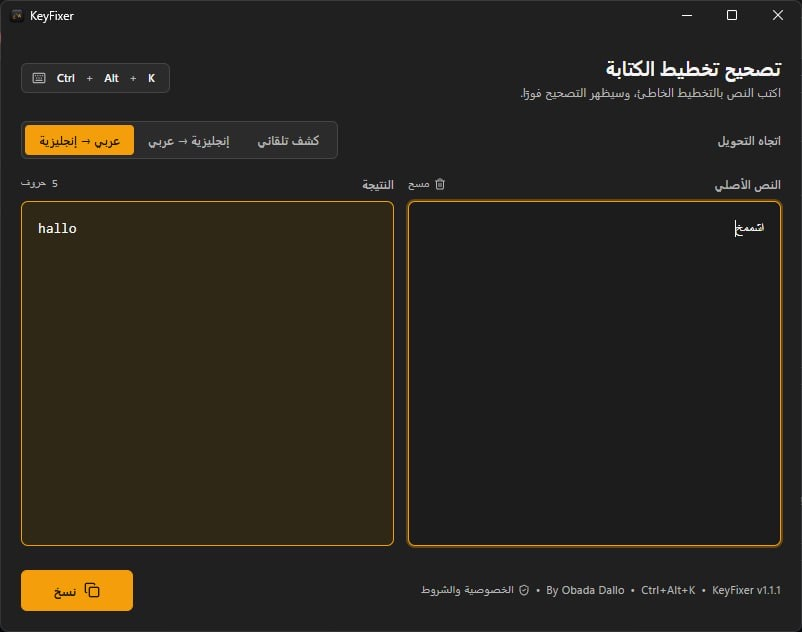
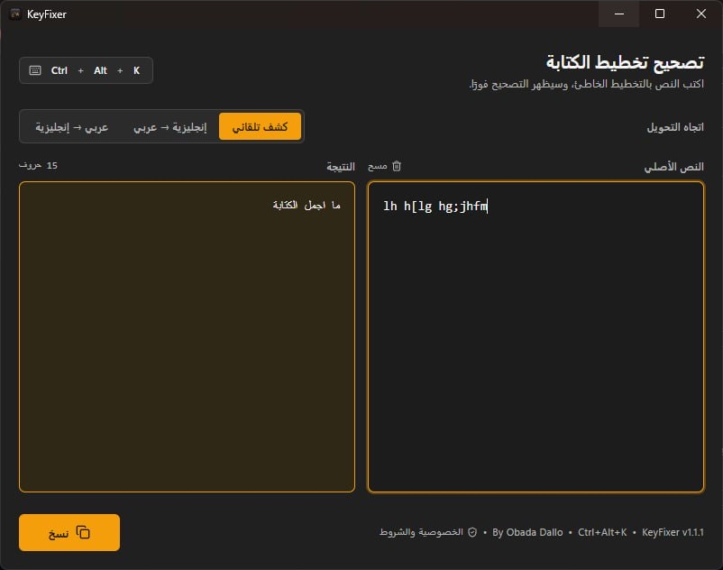
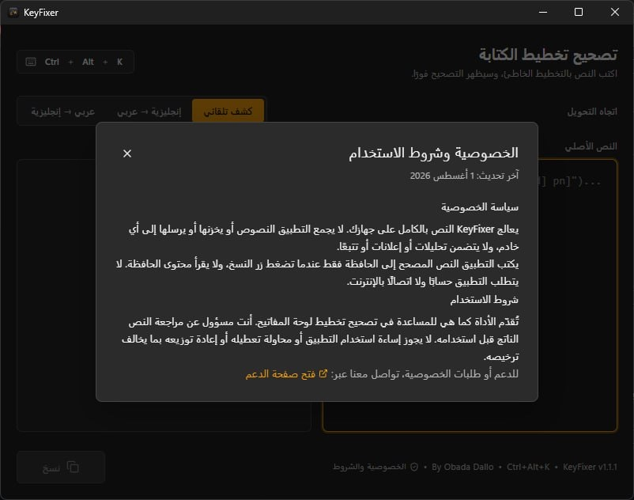

# Windows Desktop Application

KeyFixer includes a Windows desktop application that builds as a native executable with an NSIS installer via Tauri.

## Build Requirements

- Rust (latest stable)
- Node.js 22.x
- Windows 10/11 for native compilation (or a suitable cross-compilation environment)

## Building for Windows

Run the following command to build the Windows NSIS installer:

```bash
npm install
npm run build:desktop
npm run build:windows
```

The resulting NSIS installer will be located at:
`src-tauri/target/release/bundle/nsis/`

## Features & Behavior

- **Global Shortcut:** `Ctrl+Alt+K` toggles the application from anywhere.
- **Keyboard Layout:** The Windows app automatically uses the **Windows Arabic 101** mapping for text conversions.
- **System Tray:** A tray icon is provided. Clicking it toggles the main window. You can also right-click to show the window or quit the app.
- **Background Mode:** Closing the window hides it in the background instead of quitting. Use the tray menu to quit fully.

## Screenshots

The Windows interface is designed for Windows 11 while preserving KeyFixer's amber accent and right-to-left Arabic workflow.

### English to Arabic conversion

The user can explicitly select the conversion direction when it is known.



### Automatic direction detection

Auto Detect chooses the appropriate Arabic or English conversion direction from the entered text.



### Privacy and terms

The in-app privacy and terms dialog explains the local-only processing model and offers the support route.



## Microsoft Store

KeyFixer is available on the Microsoft Store as a packaged Win32 MSIX application.

The MSIX build is separate from the NSIS installer and uses a manual `MakeAppx.exe`
workflow (Tauri v2 does not have a native MSIX bundle target).

**Build command:**

```bash
npm run build:windows:msix
```

**Output:** `src-tauri/target/release/bundle/msix/KeyFixer_1.1.1.0_x64.msix`

**CI workflow:** `.github/workflows/microsoft-store-msix.yml`

For full details — Partner Center identity values, signing instructions, local testing,
Store upload steps, and version increment rules — see:

→ [docs/microsoft-store-msix.md](microsoft-store-msix.md)

